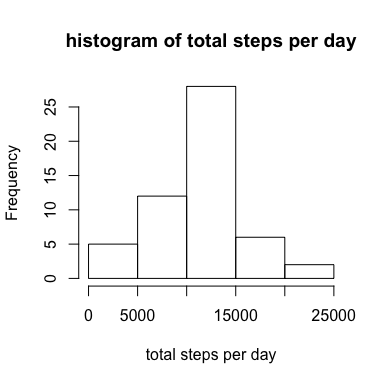
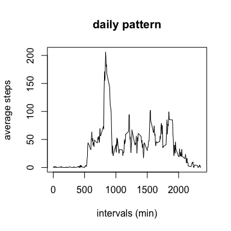
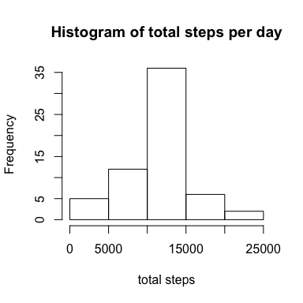
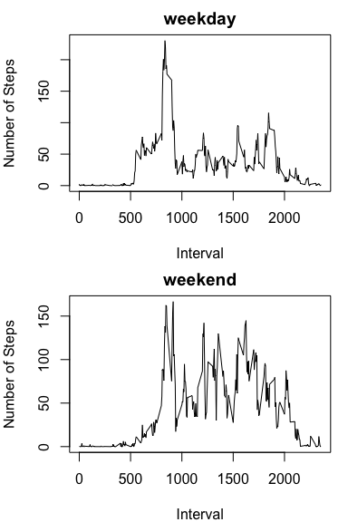

# Assignment_Activity.Rmd
1. Loading and preprocessing the data.
In my computer, I've already set up working directory. So I need to download, unzip and load the data. I also use str() to check the data, and decide to change type of "date" from factor to date


```r
library(knitr)
download.file("https://d396qusza40orc.cloudfront.net/repdata%2Fdata%2Factivity.zip", destfile = "./week2assignment_activity_monitor.zip", method = "curl")
unzip("./week2assignment_activity_monitor.zip", files = "activity.csv")
activity <- read.csv("./activity.csv")
## str(activity)
## change type of date from factor to date
activity$date <- as.Date(as.character(activity$date))
```

2. What is mean total number of steps taken per day?


```r
totalsteps <- tapply(activity$steps, activity$date, sum)
hist(totalsteps, xlab = "total steps per day", main = "histogram of total steps per day")
```

<!-- -->

```r
meanstep <- mean(totalsteps, na.rm = TRUE)
medianstep <- median(totalsteps, na.rm = TRUE)
```
The mean total number of steps taken per day is 1.0766189\times 10^{4}, and the median is 10765

3. What is the average daily activity pattern?


```r
dailypattern <- tapply(activity$steps, activity$interval, mean, na.rm=TRUE)
intervals <- as.integer(unlist(attr(dailypattern,"dimnames")))
steps <- as.vector(dailypattern)
df <- data.frame(intervals = intervals, steps = steps)
plot(x=df$intervals, y= df$steps, type = "l", xlab = "intervals (min)", ylab = "average steps", main = "daily pattern")
```

<!-- -->

```r
max_interval <- df$intervals[which.max(df$steps)]
max_step <- max(df$steps)
```
The interval with maximum number of steps is 835, and the average steps is 206.1698113

4. Imputing missing values


```r
ok <- complete.cases(activity)
n <- sum(!ok)
```
There are 2304 rows in the dataset with missing data

I'll use mean steps for 5-min interval to fill the missing values


```r
newactivity = activity
for (i in 1:17568) {
  if (ok[i] == FALSE) {
    x <- newactivity$interval[i] 
    newactivity$steps[i] = df$steps[df$intervals==x]
  }
}
newtotalsteps <- tapply(newactivity$steps,newactivity$date, sum)
hist(newtotalsteps, xlab = "total steps", main="Histogram of total steps per day")
```

<!-- -->

```r
newmeanstep <- mean(newtotalsteps, na.rm = TRUE)
newmedianstep <- median(newtotalsteps, na.rm = TRUE)
```
After filling in missing values, the new mean total steps per day is 1.0766189\times 10^{4}, and the new median is 1.0766189\times 10^{4}. Both numbers are almost same with before.

5. Are there differences in activity patterns between weekdays and weekends?


```r
wd <- weekdays(newactivity$date) %in% c("Saturday", "Sunday")
wd <- factor(wd, levels = c(TRUE, FALSE), labels = c("Weekend","Weekday"))
newactivity$weekday <- wd

split_data <- split(newactivity, newactivity$weekday)
time.interval <- unique(newactivity$interval)
wkday <- tapply(split_data$Weekday$steps, split_data$Weekday$interval, mean)
wkend <- tapply(split_data$Weekend$steps, split_data$Weekend$interval, mean)
df1 <- data.frame(interval = time.interval, weekday = as.vector(wkday), weekend = as.vector(wkend))

par(mfrow = c(2,1), mar=c(4,4,2,1))
plot(df1$interval, df1$weekday, main="weekday", type="l", xlab="Interval", ylab="Number of Steps")
plot(df1$interval, df1$weekend, main="weekend", type="l", xlab="Interval", ylab="Number of Steps")
```

<!-- -->
